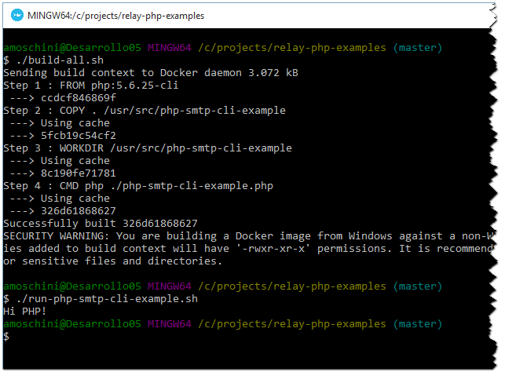

# Doppler Relay PHP Examples

In this repository you will find a series of examples about how to consume Doppler 
Relay services using PHP.

If you use [docker](https://www.docker.com/) you do not need to install nothing else
to run the examples. Simply run `build-all.sh` and then the desired _run*_ file, for
example `run-php-smtp-cli-example.sh`. **Important:** Do not forget to run `build-all.sh`
if you change something.

